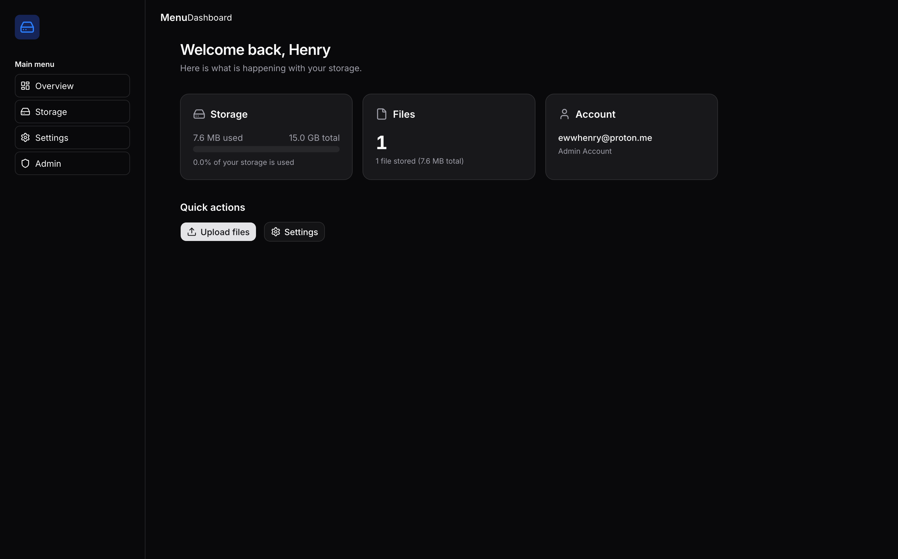

# Selfie 📁

> A self-hosted file storage you actually own.



Selfie is a lightweight, self-hosted file storage server built with **Node.js**, **TypeScript**, **Hono**, and **PostgreSQL + Prisma**. Designed to run on minimal hardware — including a rooted Android device with Termux.


---

## Features

- **🔐 Multi-user auth** with JWT _(access + refresh tokens)_
- **👑 Role-based access** — `USER` and `ADMIN` roles; the first registered user automatically gets `ADMIN`
- **⬆️ Upload / ⬇️ Download / 🗑️ Delete** files via REST API and Web UI
- **📊 Per-user storage quotas** — enforced before upload (default 5 GB)
- **🔁 Automatic token rotation** — seamless refresh on expiry
- **📱 Runs on Termux** — minimal hardware, fully self-contained
- **☁️ Cloudflare Tunnel ready** — expose securely without a public IP

---

## Tech Stack

| Layer | Technology |
|---|---|
| Runtime | [Node.js](https://nodejs.org) 20+ |
| Framework | [Hono](https://hono.dev) — ultralight, fast |
| Language | [TypeScript](https://www.typescriptlang.org) (strict mode) |
| ORM | [Prisma](https://www.prisma.io) 7 — type-safe database access |
| Database | [PostgreSQL](https://www.postgresql.org) |
| Auth | JWT via `jsonwebtoken` + `scryptSync` (salted & peppered) |
| Client | [Next.js](https://nextjs.org) 16 + [React](https://react.dev) 19 + [Tailwind CSS](https://tailwindcss.com) 4 |
| UI Kit | [shadcn/ui](https://ui.shadcn.com) (radix-nova) |
| Monorepo | [Turborepo](https://turbo.build/repo) |
| Linting | [Biome](https://biomejs.dev) |
| Tunnel | [Cloudflare Tunnel](https://developers.cloudflare.com/cloudflare-one/connections/connect-networks) (optional) |

---

## Architecture

```
┌─────────────────┐       ┌───────────────────┐       ┌────────────┐
│   Next.js App   │──────▶│   Hono API Server  │──────▶│ PostgreSQL │
│  (apps/client)  │ HTTP  │   (apps/server)    │  SQL  │            │
│  Port 3000      │◀──────│   Port 3001        │◀──────│            │
└─────────────────┘       └────────┬──────────┘       └────────────┘
                                   │
                                   ▼
                           ┌────────────────┐
                           │  File Storage  │
                           │  ./uploads/    │
                           └────────────────┘
```

The monorepo contains two apps orchestrated by Turborepo:

- **`apps/client`** — Next.js dashboard UI (login, signup, file browser, storage overview)
- **`apps/server`** — Hono REST API (auth, file CRUD, user management, health checks)

File uploads are stored on disk under `STORAGE_DIR` (default `./uploads/`). Metadata, user accounts, and sessions live in PostgreSQL.

---

## Project Structure

```
SELFIE/
├── apps/
│   ├── client/                        # Next.js frontend
│   │   ├── src/
│   │   │   ├── app/
│   │   │   │   ├── (auth)/            # Login & Signup pages
│   │   │   │   │   ├── login/
│   │   │   │   │   └── signup/
│   │   │   │   ├── (dashboard)/       # Dashboard pages
│   │   │   │   │   └── dashboard/     # Overview & Storage views
│   │   │   │   └── layout.tsx         # Root layout (dark theme, Inter font)
│   │   │   ├── components/
│   │   │   │   ├── ui/                # shadcn/ui primitives
│   │   │   │   ├── DashboardSidebar.tsx
│   │   │   │   └── DashboardTopbar.tsx
│   │   │   ├── contexts/UserContext.tsx
│   │   │   ├── hooks/useUser.ts
│   │   │   ├── lib/api.ts             # Axios client with all API calls
│   │   │   └── types/API.ts           # Shared TypeScript types
│   │   └── public/
│   └── server/                        # Hono REST API
│       ├── prisma/
│       │   ├── migrations/            # 4 database migrations
│       │   └── schema.prisma          # User, Session, File models
│       ├── src/
│       │   ├── controllers/           # Route handlers
│       │   ├── lib/                   # Utilities (JWT, crypto, config)
│       │   ├── middleware/            # Auth & admin middleware
│       │   ├── routes/                # Route definitions
│       │   ├── services/              # Business logic (auth, quota, files)
│       │   └── types/                 # Hono extension types
│       └── nodemon.json
├── packages/                          # (empty — for future shared packages)
├── biome.json                         # Biome linter/formatter config
├── package.json                       # Monorepo root (Turborepo)
├── pnpm-workspace.yaml               # Workspace definition
├── turbo.json                         # Turborepo pipeline config
└── .env.example files                 # Environment templates
```

---

## Getting Started

### Prerequisites

- [Node.js](https://nodejs.org) 20+
- [pnpm](https://pnpm.io) (`npm i -g pnpm`)
- [PostgreSQL](https://www.postgresql.org) — local, remote, or via [Termux](https://termux.com)
- [Cloudflare account](https://dash.cloudflare.com) — only if using Cloudflare Tunnel

### Installation

```bash
git clone https://github.com/ewwhenry/SELFIE
cd SELFIE
pnpm install
```

### Environment Setup

```bash
cp .client_env.example apps/client/.env
cp .server_env.example apps/server/.env
```

Edit both `.env` files:
- **`apps/server/.env`** — set `DATABASE_URL`, `JWT_SECRET`, `ARGON2_SECRET`
- **`apps/client/.env`** — set `NEXT_PUBLIC_API_URL`

#### Server Environment Variables

| Variable | Default | Description |
|---|---|---|
| `DATABASE_URL` | — | PostgreSQL connection string |
| `JWT_SECRET` | `"your_jwt_secret"` | Secret for signing JWT access tokens |
| `ARGON2_SECRET` | — | Pepper for password hashing (scrypt) |
| `PORT` | `3001` | Server listen port |
| `NODE_ENV` | `"development"` | Set to `"production"` in production |
| `DOMAIN` | — | Your domain (used for CORS & cookies) |
| `STORAGE_DIR` | `"./uploads"` | Directory for uploaded files |

_Access tokens: 15 min TTL · Refresh tokens: 30 day TTL_

#### Client Environment Variables

| Variable | Default | Description |
|---|---|---|
| `NEXT_PUBLIC_API_URL` | `"http://localhost:3001"` | Base URL of the API server |

### Database Setup

```bash
cd apps/server
pnpm exec prisma migrate dev --name init
pnpm exec prisma generate
```

This creates the required tables: `User`, `Session`, and `File`.

### Run

```bash
# Development (both client & server concurrently)
pnpm dev

# Production build
pnpm build

# Production start
pnpm start
```

---

## API Reference

### Health

| Method | Path | Auth | Description |
|---|---|---|---|
| `GET` | `/health` | — | Returns `{ message: "API is UP" }` |
| `GET` | `/health/db` | — | Database connectivity check with response time |

### Auth

All auth endpoints return `access_token` and `refresh_token` as httpOnly cookies.

| Method | Path | Auth | Description |
|---|---|---|---|
| `POST` | `/auth/register` | — | Register new user. Body: `{ email, password, first_name, last_name }` |
| `POST` | `/auth/login` | — | Login. Body: `{ email, password }` |
| `POST` | `/auth/refresh` | — | Refresh tokens. Body: `{ refresh_token }` |

### Users

| Method | Path | Auth | Description |
|---|---|---|---|
| `GET` | `/users/me` | Cookie | Get current user profile (id, role, email, name, quota, usage) |

### Files

| Method | Path | Auth | Description |
|---|---|---|---|
| `GET` | `/files` | Cookie | List user's files (`?cursor=&limit=10`, cursor-based pagination) |
| `POST` | `/files/upload` | Cookie | Upload file (multipart form, field: `file`). Enforces quota. |
| `GET` | `/files/:file_id/download` | Cookie | Stream file download with `Content-Disposition` |
| `DELETE` | `/files/:file_id` | Cookie | Delete single file |
| `DELETE` | `/files` | Cookie | Batch delete (body: array of file IDs) |

### Authentication Flow

1. **Login/Register** — server sets `access_token` (15 min) and `refresh_token` (30 days) as httpOnly cookies
2. **Token rotation** — when `access_token` expires, the auth middleware automatically rotates both tokens using `refresh_token`
3. **Logout** — clearing cookies suffices; sessions remain in DB (TTL-based cleanup planned)

---

## Scripts

| Command | Description |
|---|---|
| `pnpm dev` | Start both apps in development mode (Turborepo) |
| `pnpm build` | Build both apps for production |
| `pnpm start` | Start production builds |
| `pnpm lint` | Lint all files with Biome |
| `pnpm format` | Format all files with Biome |
| `pnpm check` | Check all files with Biome |
| `pnpm check:fix` | Auto-fix all Biome issues |

---

## Roadmap

- [x] Multi-user auth with JWT
- [x] Upload / download / delete files
- [x] Per-user storage quotas
- [ ] Public share links with TTL
- [ ] Virtual folder navigation
- [ ] CLI client (`selfie upload`, `selfie list`, ...)
- [ ] Local folder watcher / sync
- [ ] Admin dashboard (user management)
- [ ] File preview (images, videos, documents)
- [ ] Database session cleanup (TTL-based)

---

## License

MIT
